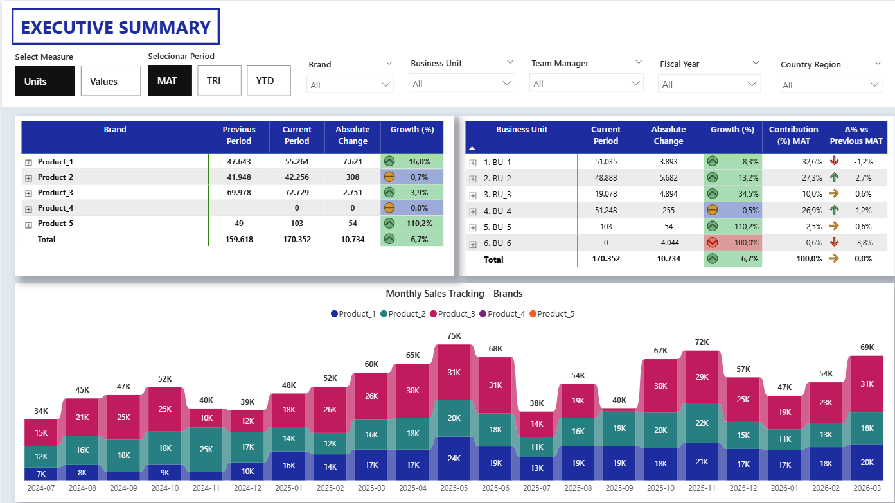
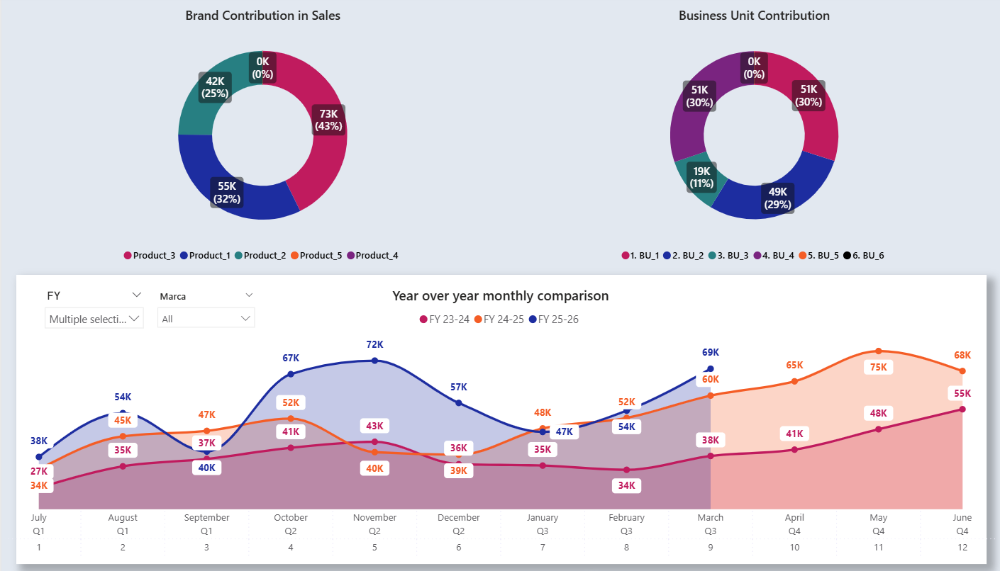
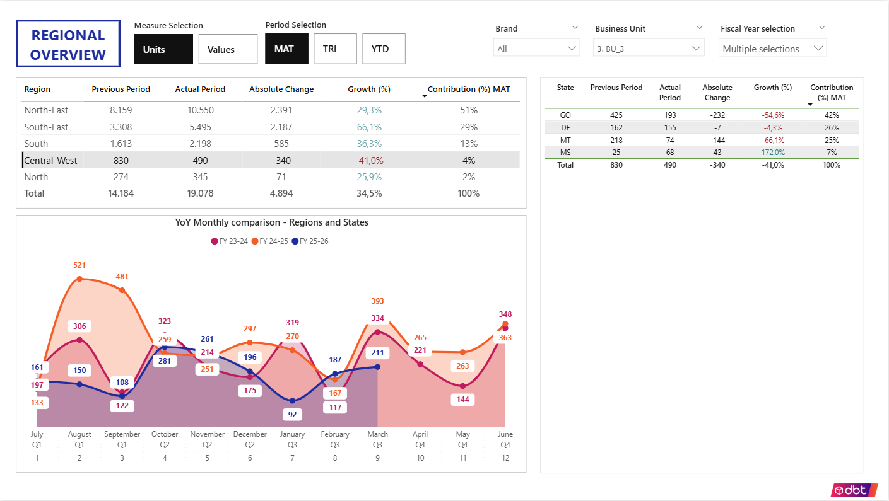
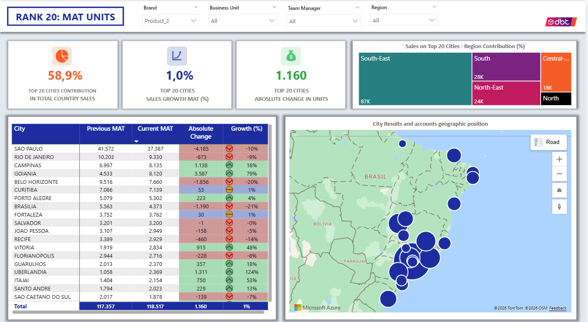

Regional Sales Analysis Dashboard
Business Problem

Sales performance varies across geographic regions and commercial structures, making it difficult to identify where performance gaps occur and where to act.

Solution

This dashboard provides a structured view of sales performance across geographic levels (country, region, state, city) and commercial hierarchy, enabling fast identification of growth opportunities and underperforming areas.

1. Executive Summary:

This page was meant to offer 'diagnostic' vision to quickly reveal key patterns in our Business.
For example: In a quick glance, we can see that our major Business Unit is having a decrease in results on MAT analysis, and also that our 2nd most profitable brand (which represents 37% of our sales) is underperforming against last MAT. Another interesting quick insight is regarding our customer base: when we look to our sales for medical specialty, we can see that 70% of our sales com from top 3 specialties, indicating potential exposure if performance drops in these segments. 

2. Regional Overview

Provides geographic breakdown starting with region

Key insights:
* Results from BU_3 shows a great performance with strong growth in every month (except September) against previous years.
* While sales performance is outstanding in 3 major regions, there's a significant gap to be identified in Central-West Region.
* Turns out that 3 of 4 Central-West states are underpefroming against last MAT, but lets go even further on next page.

3. Geographic Breakdown

Goes further in the geographical analysis, now showing performance through cities and the possibility to filter states or regions directly in the country map.

Key Insights
* Following regional analysis, here we see that the team is underperforming in 4 out of 5 most important cities in the region. Helping us to clearly know where to adress to improve this team performance.
* Using the "+" button, we can see exactly which accounts are losing performance for those cities.

4. Rank 20 - Major cities

Here we can see our top 20 cities in sales, and also locate them quickly by relevance in the country map

Key insights
* As we've seen before, Product_2 is strongly relevant and here we can clearly how it is performing in our major 20 cities across the country.
* The 1st and 2nd most important cities are underpeforming, which suggest a need for immediate action.
* While there's more cities that require attention for lack of performance, there's impressive growth in "Goiania" and "Uberlandia", that could be looked into with more detail to understand if there's actions that can be replicated to other cities.
  

