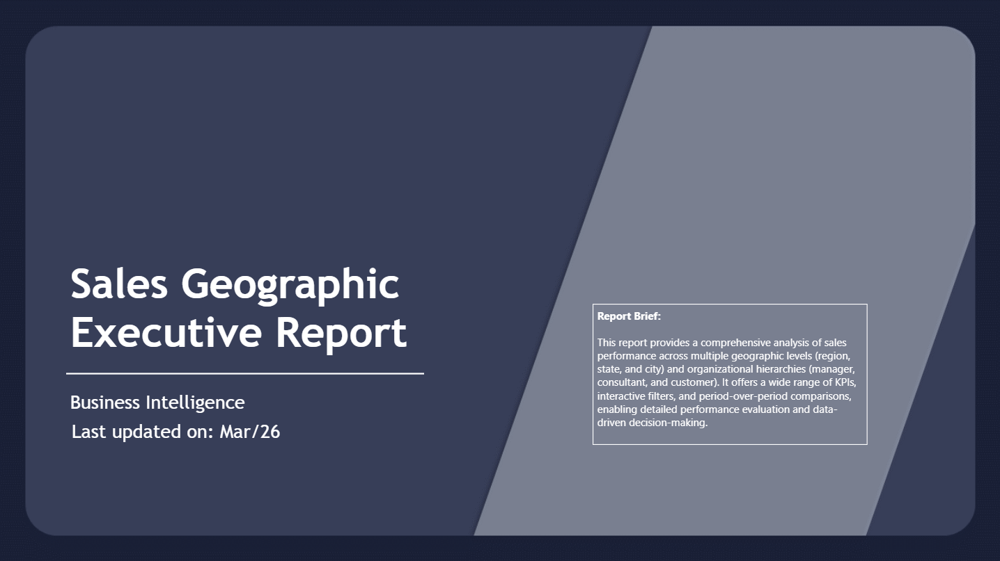
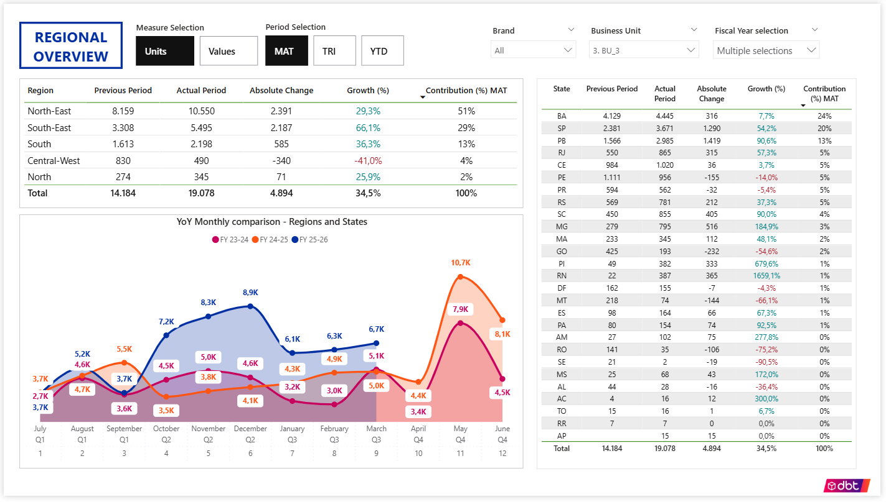
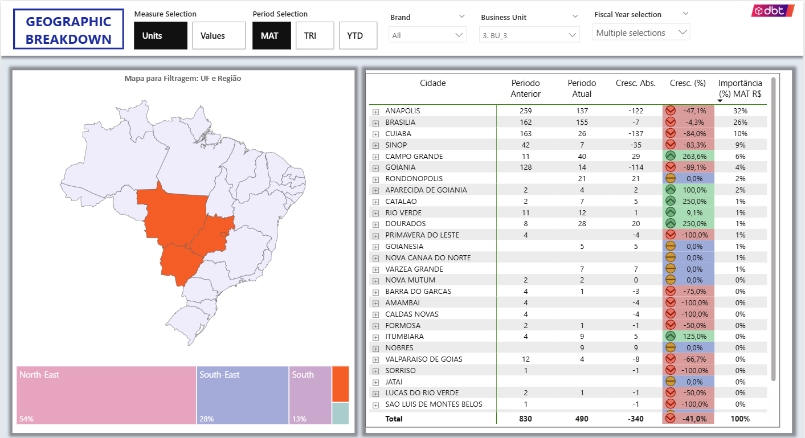
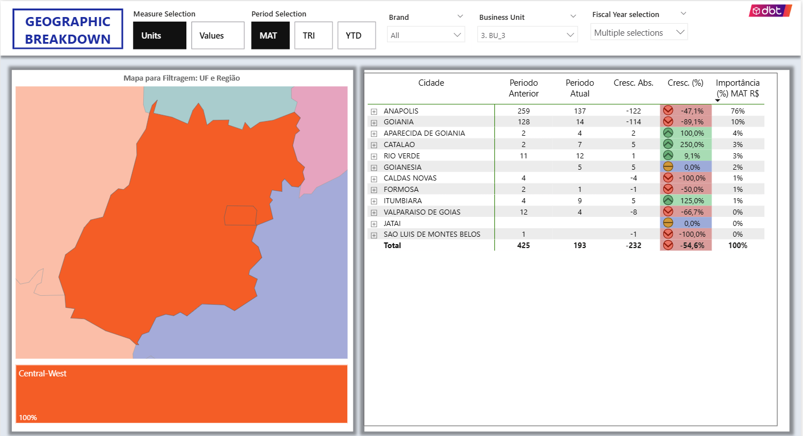

# Regional Sales Analysis Dashboard

## Business Problem
Sales performance varies across geographic regions and commercial structures, making it difficult to identify where performance gaps occur and where to act.

## Solution
This dashboard provides a structured view of sales performance across geographic levels (country, region, state, city) and commercial hierarchy, enabling fast identification of growth opportunities and underperforming areas.

---

## Executive Summary

Provides a high-level diagnostic view of business performance, highlighting key risks and opportunities.

**Key insights:**
- The main Business Unit shows declining performance in MAT analysis
- The second most profitable brand (37% of total sales) is underperforming vs previous MAT
- Sales are highly concentrated: 75% of total revenue comes from just two products, indicating portfolio concentration risk

---

## Regional Overview

Highlights performance differences across regions and identifies where growth gaps are concentrated.

**Key insights:**
- BU_3 shows strong and consistent growth across most months
- Despite strong performance in major regions, Central-West shows a significant performance gap  
- 3 out of 4 states in Central-West are underperforming, indicating a regional structural issue  

---

## Geographic Breakdown

Enables deeper analysis at city and account level, supporting targeted actions.

**Key insights:**
- Following BU 3 on Central-West region, 4 out of the 5 most important cities are underperforming  
- Performance issues are concentrated in key accounts within these cities  
- Drill-down capability ("+" button) allows precise identification of where to act  

---

## Top 20 Cities Analysis

Focuses on the most relevant cities in terms of sales contribution and performance.

**Key insights:**
- Sales are highly concentrated geographically: the top 20 cities account for ~60% of total sales, despite Brazil having over 5,000 cities
- Product_2 plays a key role in top-performing cities  
- The two most important cities are underperforming, indicating a critical priority area  
- Some cities (e.g., Goiania and Uberlandia) show strong growth, suggesting replicable success patterns  

---

## Tools
- Power BI  
- DAX  
- Data Modeling  

## Data Disclaimer
Data has been anonymized and modified to preserve confidentiality.
