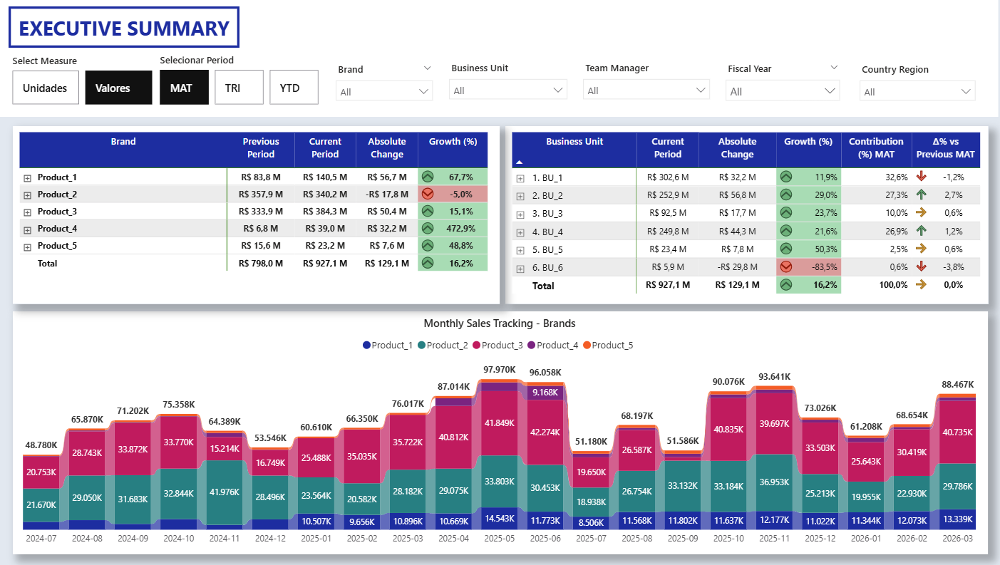
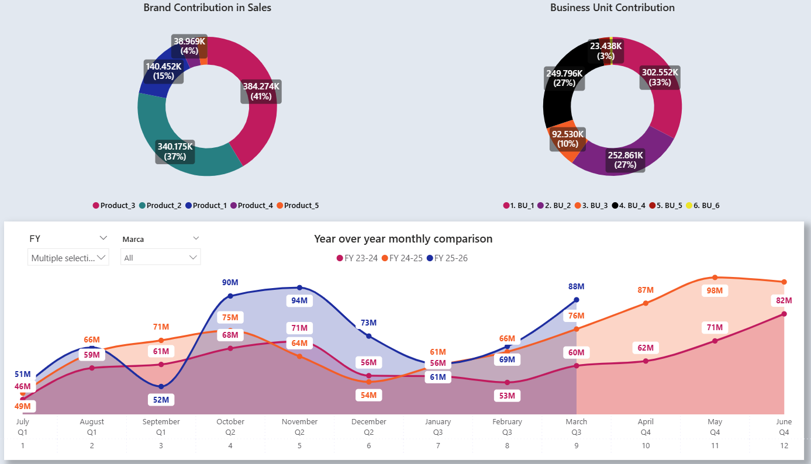
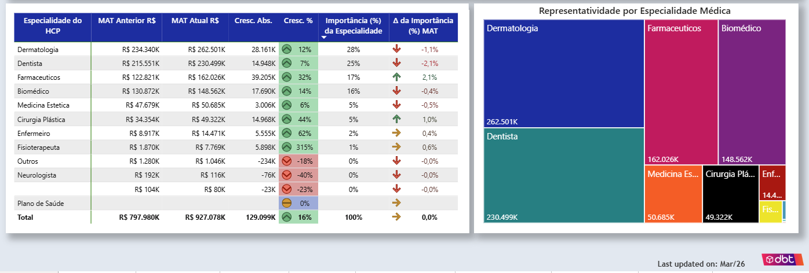

# pbi_regional_sales_analysis
This is a sales report designed to breakdown numbers in several steps in geographic (country, region, state, city) and commercial hierarchy (country manager, regional manager, district manager and sales consultants). So is possible to identify quickly where we are having growth gaps and act very accurately to it.

1. Executive Summary:

This page was meant to offer 'diagnostic' vision to quickly reveal key patterns in our Business.
For example: In a quick glance, we can see that our major Business Unit is having a decrease in results on MAT analysis, and also that our 2nd most profitable brand (which represents 37% of our sales) is underperforming against last MAT. Another interesting quick insight is regarding our customer base: when we look to our sales for medical specialty, we can see that 70% of our sales com from top 3 specialties, indicating potential exposure if performance drops in these segments. 

2. Regional Overview

Provides geographic breakdown starting with region

Key insights:
* Results from BU_3 shows a great performance with strong growth in every month (except September) against previous years.
* While sales performance is outstanding in 3 major regions, there's a significant gap to be identified in Central-West Region

3. Geographic Breakdown

This one follows the same concept, but now in more depth and with more possibilities than the last: For start, now there's a interactive Map in the left side, and this map works as a filter. Here we can click in Regions or States to quickly filter, and the table on the right now shows us the performance from every city, sorted by importance in sales, and showing in which cities we have performance gaps. But there's more: clicking on the "+" button on each city opens up every customer account in that city, also sorted by sales importance, so we can adress exactly which relevant customers are losing performance:

